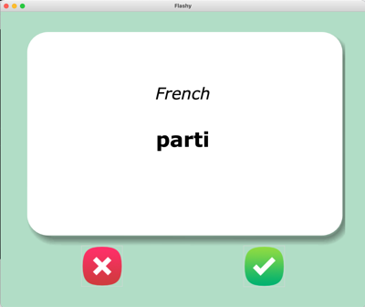
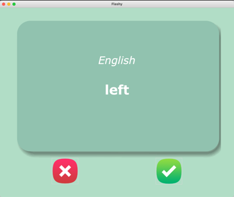

# Vocabulary Trainer - Flashcard App

A simple vocabulary learning application built with **Tkinter** that uses flashcards to help you memorize words efficiently. The app reads vocabulary from a CSV file, shows each word for up to 3 seconds, and helps you track learned and unlearned words.

## Features

- Display vocabulary flashcards with a word in the first language (front side) and its translation (back side).
- Every word is shown for up to **3 seconds** before flipping to the translation.
- If you mark a word as known, it will be removed from the learning list.
- Unlearned words are saved for future sessions, allowing you to continue where you left off.
- The vocabulary data is stored in **CSV format** in the `data` folder.

## How It Works

1. Place your vocabulary list in a **CSV file** inside the `data` folder. The file should contain two columns: the first column for words in language 1 (e.g., French) and the second column for words in language 2 (e.g., English).
   
2. Run the app, and it will pick random words from the CSV file. The word will be shown in the first language for up to **3 seconds**, then flip to display the translation in the second language.

3. Mark the word as known or unknown by clicking the respective buttons. Known words will be removed from the learning set and stored separately.

## Screenshots

